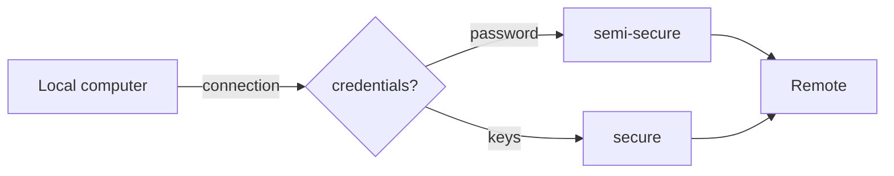

### Chapter 1

# Basics

Here, you will learn how to set up your computer to connect to remote resources and some tips that will make this task easier.

```mermaid
graph LR;
  A[Local computer] -->|connection| B{credentials?}
    B -->|password| C[semi-secure]
    B -->|keys| D[secure]
    C --> E[Remote]
    D --> E[Remote]
```

## Summary
