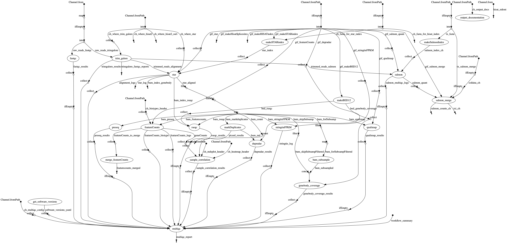
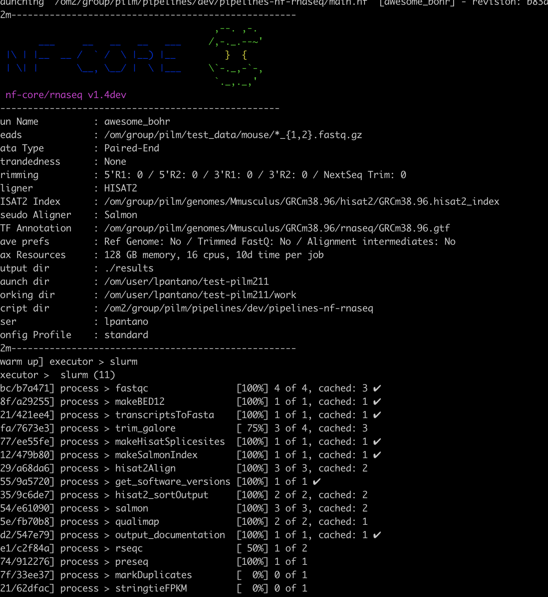

* Documentation: https://pilm-bioinformatics.github.io/pipelines-nf-rnaseq/
* Public dataset browser: https://ewels.github.io/sra-explorer/#

## Scheme

Pipeline Overview: https://pilm-bioinformatics.github.io/pipelines-nf-rnaseq/output.html

## Logging

## Important parameters

* `--pseudo_aligner salmon`: to run best practices for gene/transcript quantification
* `--singleEnd`: in case of not being paired dataset
* `--aligner hisat2`: to reduce the resources during alignment (if salmon is on)
* `--skipGenebodyCoverage`: long process that gives the same information than Qualimap
* `--skipDupRadar`: long process that gives similar information than Qualimap
* `--skipPreseq`: long process that gives similar information than Qualimap
* `--skipRseQC`: long process that gives similar information than Qualimap