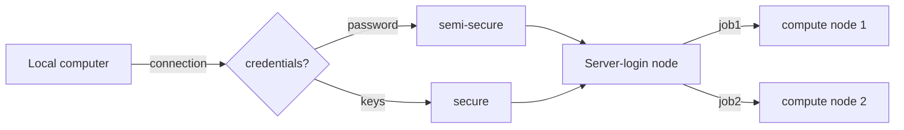

### Chapter 2

# Remote actions

Here, you will learn how to interact with remote computers, transfer files and send jobs to a cluster.

```mermaid
graph LR;
  A[Local computer] -->|connection| B{credentials?}
    B -->|password| C[semi-secure]
    B -->|keys| D[secure]
    C --> E[Server-login node]
    D --> E[Server-login node]
    E -->|job1| F[compute node 1]
    E -->|job2| G[compute node 2]
```