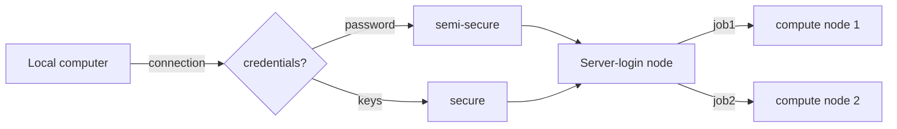

### Chapter 3

This chapter is in case the main server is not working so we need to use a local tiny remote resource to go through the materials.

Download the [key](https://github.mit.edu/PILM-bioinformatics/support/raw/master/workshops/pim103/pilm103_rsa) to get access.

```
cd
wget https://github.mit.edu/PILM-bioinformatics/support/raw/master/workshops/pim103/pilm103_rsa
```

Every student will have a user name given during the lecture.

# Remote actions

Here, you will learn how to interact with remote computers, transfer files and send jobs to a cluster.



How you jobs get schedule:

- According to the requested resources/ available resources
- According your **Fairshare** score:
  - number of jobs/resources requested in the past
  - precision of the resources requested vs needed